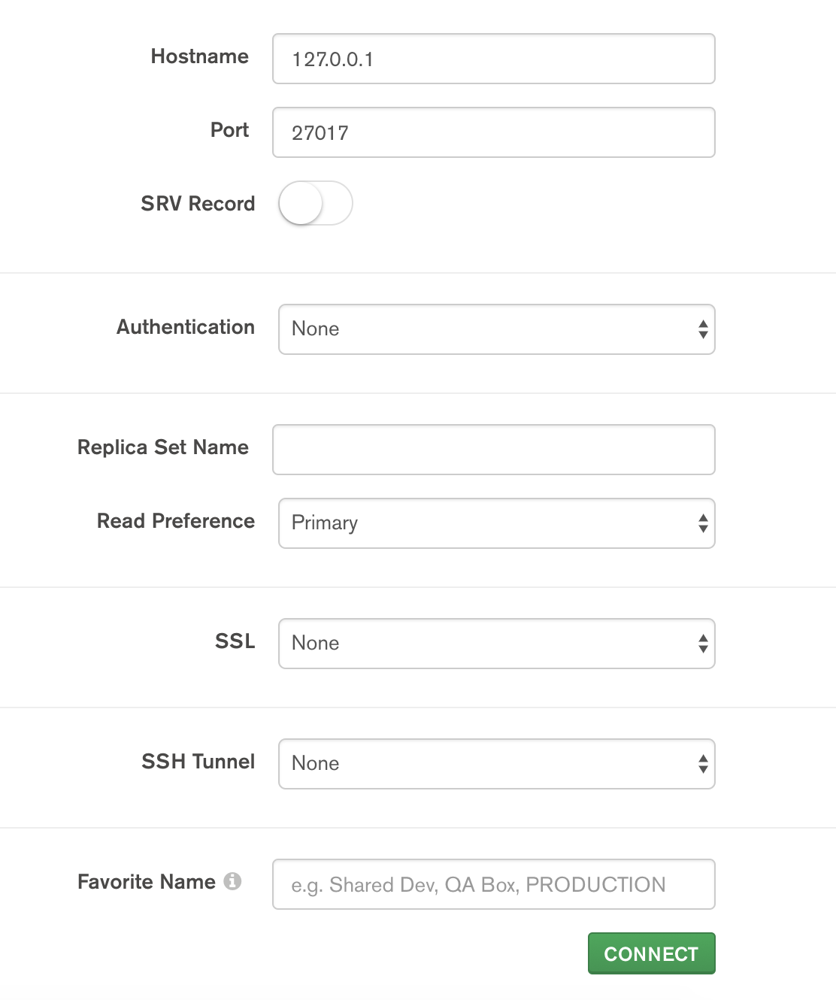
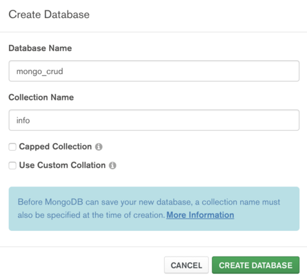

### Node Mongoose CRUD Application

A sample application to see how CRUD operations works in Node/Mongo world. This is an example for educational purposes.

### Project Dependencies

You should have these dependencies installed on your system in order to run the application.


##### Main Dependencies

* [NodeJs and NPM](https://nodejs.org)
* [MongoDb](https://www.mongodb.com)

##### Optional Dependencies

* [Postman](https://www.getpostman.com)
* [MongoDB Compass](http://bit.ly/MongoDbCompass)

We will use Postman to test our API and MongoDB Compass to check the database.

### Project Setup

After you cloned the project source code in to your system, change your directory to the project folder and run

``` 
npm install
```

This will install all project's dependencies into a folder called `node_modules` inside the project's root directory.
For the ease of development we're using [Nodemon](https://nodemon.io/) to keep the server alive. In order to install Nodemon on your system run

```
npm install -g nodemon
```

The `-g` flag will install this package globally on your system so that you can use Nodemon from any directory. If you prefer not to use Nodemon you should change the `package.json` file and on the `scripts` section in the start command replace the `nodemon` with `node`.


Make sure you have MongoDB installed on your system and `mongod` service is running on port `27017`. Ofcourse you can change the port to whatever you want later.

For more information on how to setup the MongoDB please read the following links based on your OS

* [MacOS](http://bit.ly/MongoDBonMac)
* [Windows](http://bit.ly/MongoDBonWindows)
* [Windows(Community)](http://bit.ly/MongoDBonWindows-community)
* [Linux](http://bit.ly/MongoDBonLinux)

After installing MongoDB and run the Mongod service, you should connect to your mongodb server and create a database. I suggest to install MongoDb Compass in order to do this more easily.


#### Connecting to MongoDb Server :



Then create a database. I used `mongo_crud` but you can name it whatever you want.



#### Config Application

There is a file called `config.js` in the projects root directory. Edit the file based on your own settings

```
** config.js

module.exports = {
    mongo_db    :   'mongo_crud', // Enter your database name here
    mongo_ip    :   '127.0.0.1', // Your mongodb server ip. You can also use localhost
    mongo_port  :   '27017' // The port that mongodb is listening on. Defaults to 27017
}

```

Now you can run the application by running

```
npm start
```

in projects root directory.

If everything was okay you should see this message

```
[nodemon] starting `node ./bin/www`
Successfuly connected to database!
```


Now you're ready my son!


